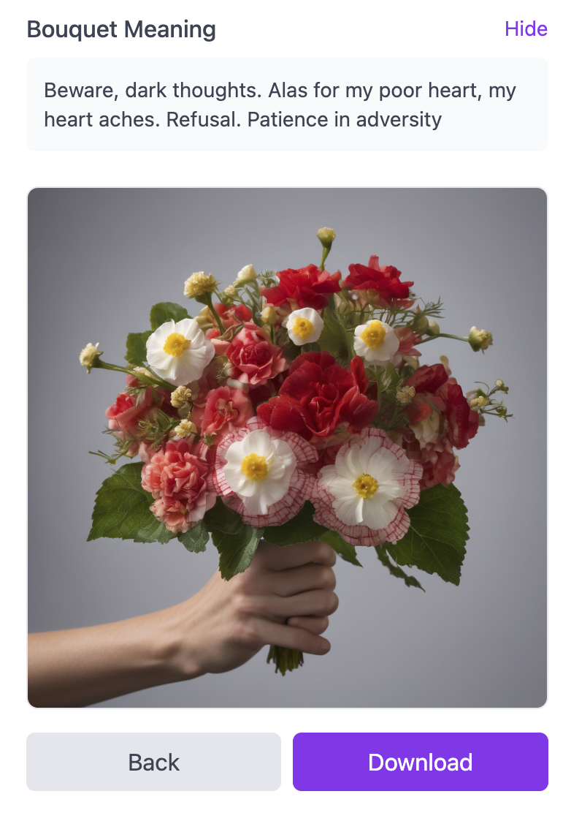
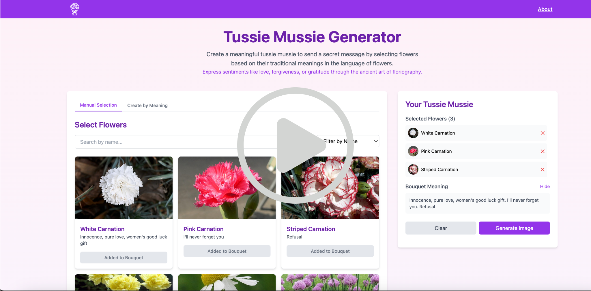

# 💐 Tussie-Mussie Generator

Welcome to **The Tussie-Mussie Generator** – a charming web app that lets you create and share AI-generated Victorian-style digital bouquets (bouquAIs), also known as *tussie-mussies*. Each flower in your arrangement carries a symbolic message, inspired by the historic *language of flowers* 🌸✨ Send your message to your love, your Mom, your friend, or yourself as an e-card!

🖥️ **Create your BouquAI here:** [https://tussie-mussies.netlify.app/](https://tussie-mussies.netlify.app/)

## 🌼 What is a Tussie-Mussie?

A tussie-mussie is a small bouquet traditionally used to convey coded sentiments. Popularized by Queen Victoria, they are the ultimate "love code". With this app, you can recreate this experience and compose your own bouquet using symbolic flowers, then save or share it as a unique, personalized message.

## ✨ Features

- 🌷 Compose custom bouquets with meaningful flowers
- 📖 Learn what each flower symbolizes
- Create by meaning or individually
- Send your bouquet as an e-card

## Demo

 "Demo video")

## 🛠 Tech Stack

- [Astro](https://astro.build/) – static site builder
- [Vue 3](https://vuejs.org/) – bouquet builder component
- [Cloudinary](https://cloudinary.com/) – for storing generated bouquet images
- 🤖 Images generated using [Stability AI](https://stability.ai/)
- ✉️ E-card implementation using [Mailgun](https://mailgun.com)

&copy; Jen Looper - MIT License
